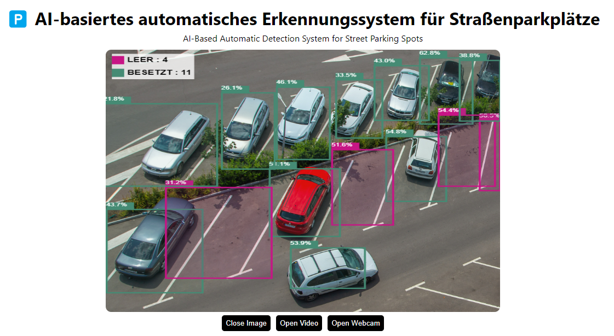
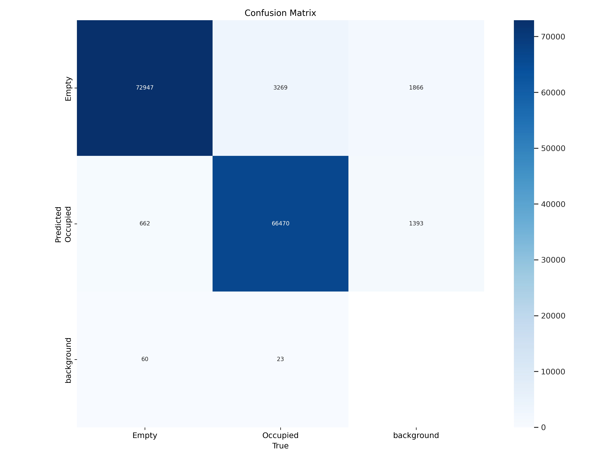
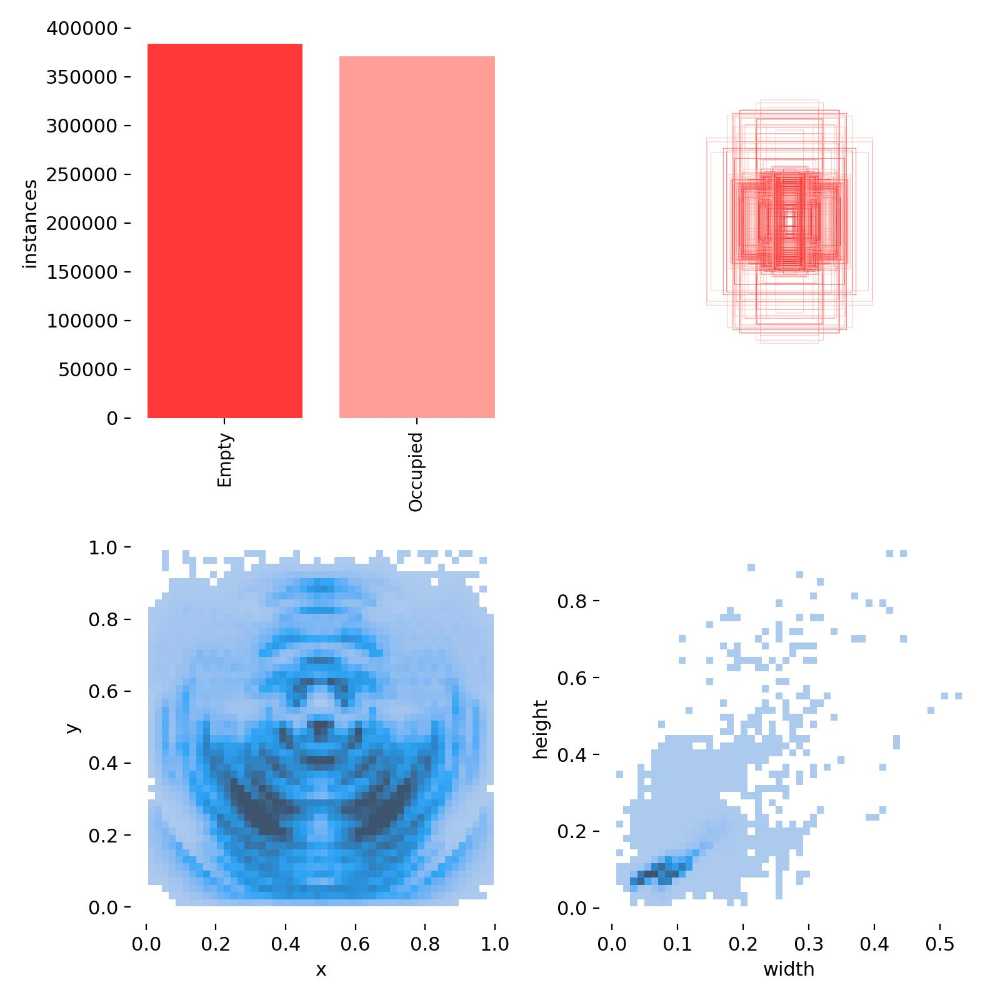
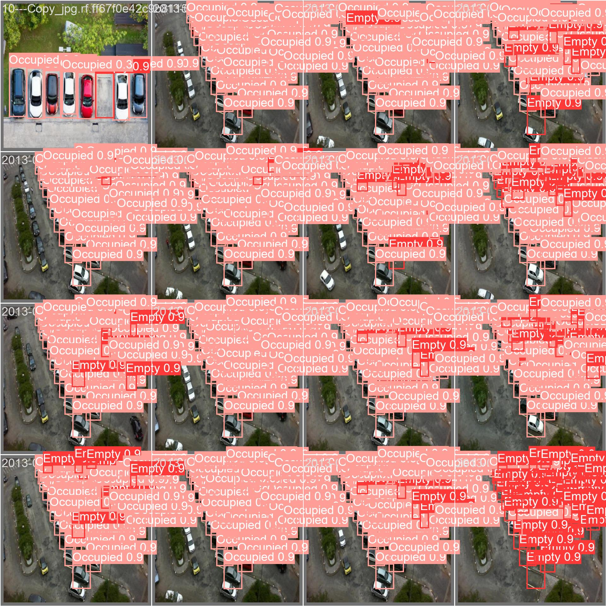

# 🅿️ AI-basiertes automatisches Erkennungssystem für Straßenparkplätze

  

---
Über den folgenden Link können Sie Ihre Bilder oder Videos direkt hochladen und testen, sogar Live-Videos von Ihrer Kamera können getestet werden.

Through the link below, you can directly upload and test your images or videos, even test video streams from your camera.

## https://miaoima.github.io/Parkfinder/
---

### DE：

---

**Projekthintergrund:**  
Parkprobleme sind ein allgemeines Problem für Bewohner im Stadtzentrum.  
Bewohner ohne festen Parkplatz müssen oft an der Straße nach verfügbaren Parkplätzen suchen, was sowohl zeitaufwendig als auch frustrierend sein kann.  
Aktuell müssen Menschen ständig überprüfen, ob am Straßenrand Parkplätze verfügbar sind, was kein effizienter Prozess ist.

**Projektziel:**  
Einsatz von AI-Technologie zur automatischen Erkennung freier Parkplätze am Straßenrand.  
Automatische Benachrichtigung der Nutzer durch das System, sobald ein freier Parkplatz erkannt wird.

**Technik und Umsetzung:**  
1. Die vorhandenen Datensätze sind sowohl quantitativ als auch qualitativ sehr hochwertig, wie man an der Konfusionsmatrix und den Label-Grafiken erkennen kann.

  

  

2. Aufgrund von Zeitbeschränkungen wurde das Modell in mehreren Durchläufen trainiert, wobei jeder Durchlauf 300 Epochen umfasste. Wie man jedoch an der Verlustgrafik (Loss) erkennen kann, sollte das Modell für mehr Epochen trainiert werden, da der Verlust noch nicht stabilisiert ist.

  

  

**Projektbeschreibung:**  
Dieses Projekt zielt darauf ab, das häufig auftretende Parkproblem von Bewohnern im Stadtzentrum zu lösen, indem AI-Technologie zur automatischen Erkennung von freien Parkplätzen am Straßenrand eingesetzt wird und Benutzer automatisch benachrichtigt werden, wenn ein Parkplatz gefunden wird. Obwohl das vorläufige Training des Modells mit einem vorhandenen Daten-Set von Freiluftparkplätzen nicht die gewünschten Ergebnisse lieferte, planen wir, ein Daten-Set zu erstellen, das besser zu den tatsächlichen Anwendungsszenarien passt, um die Vorhersageleistung des Modells weiter zu optimieren und den Nutzern genauere Parkplatzinformationen zur Verfügung zu stellen.

---

### EN：

---

**Project Background:**  
Parking issues are a common concern for residents in city centers.  
Residents without a dedicated parking spot often need to seek available parking spaces on the street, which can be both time-consuming and irritating.  
Currently, individuals typically have to continuously check for available spots on the street, which is not an efficient process.

**Project Objective:**  
Utilize AI technology to automatically detect vacant parking spots on the street.  
Automatically notify users through the system once a vacant parking spot is identified.

**Technology and Implementation:**  
1. The existing datasets are of very high quality and quantity, as can be seen from its confusion matrix and label images.
2. Due to time constraints, the model was trained in batches, each consisting of 300 epochs. However, as can be observed from the loss graph, the model should be trained for more epochs as the loss has not yet stabilized.

**Project Description:**  
This project aims to resolve the prevalent parking issues encountered by city-center residents by employing AI technology to automatically detect free street-side parking spots and automatically alert users upon identifying a parking spot. While the preliminary model training with an existing open-air parking lot dataset did not deliver desired results, we plan to establish a dataset more aligned with actual application scenarios to further enhance the model’s predictive performance and provide users with more accurate parking spot information.

---

